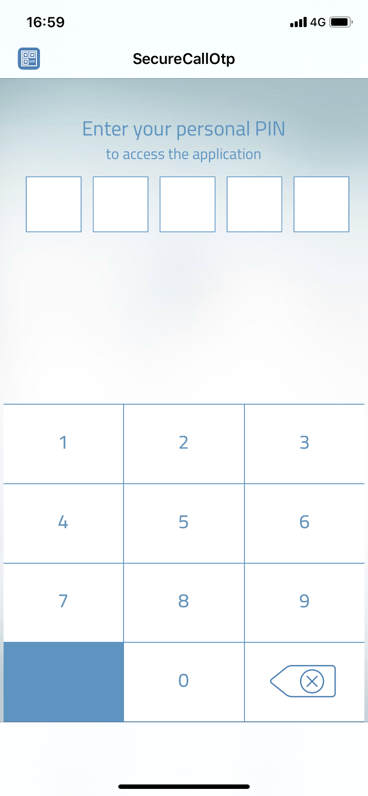

# SCPinKeyboard

Simple and highly customizable views to insert a PIN: a keyboard and masked PIN.

* SCKeyboard: keyboard created using a xib, compatible with internal project using a `@IBDesignable` class
* SCCollectionKeyboard: keyboard created using a UICollectionView.

